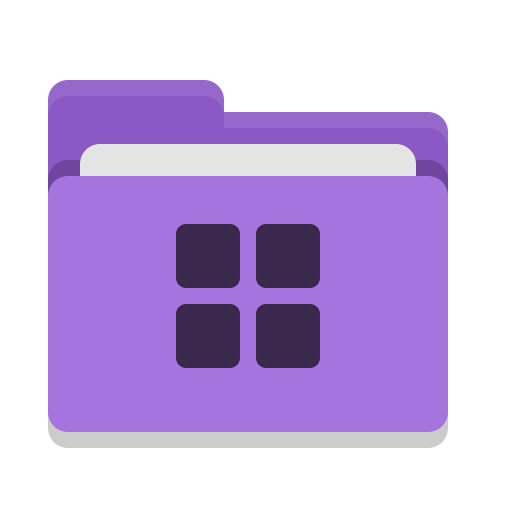
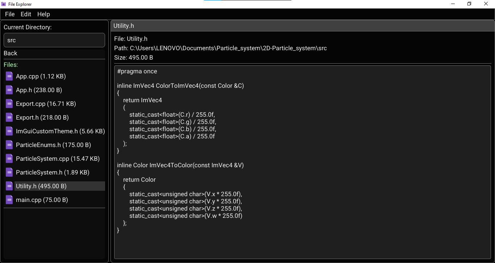

# File Explorer

<p align="center">
  
</p>

A modern file explorer application built with C++ using Raylib and Dear ImGui frameworks.



## Dependencies

- [raylib](https://www.raylib.com/) - A simple and easy-to-use game development library
- [Dear ImGui](https://github.com/ocornut/imgui) - Immediate mode GUI library
- [rlImGui](https://github.com/raylib-extras/rlImGui) - ImGui backend for Raylib

## Building

1. Make sure you have CMake installed
2. Clone this repository
3. Build the project:

```bash
mkdir build
cd build
cmake ..
cmake --build .
```

## Usage

After building, run the executable to launch the File Explorer. You can:

- Use the File menu to open new directories
- Navigate through directories using the side panel
- Click on directories to enter them
- Use "back" to go up one directory level
- View file sizes in human-readable format

## Contributing

Feel free to open issues and pull requests to help improve this project.
